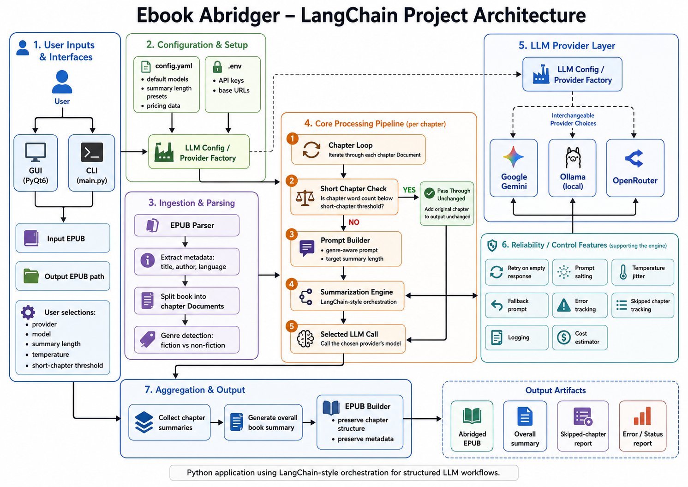

# Ebook Abridger

A Python application to generate abridged versions of EPUB ebooks using Large Language Models (LLMs). It preserves chapter structure, narrative flow, and key elements (dialogue, descriptions) while reducing length according to configurable settings.

Provides both a Command‑Line Interface (CLI) and a Graphical User Interface (GUI), plus options for cost estimation, summary-length tuning, and error/skipped‑chapter reporting.



## 🚀 Features

- **EPUB I/O**: Read standard EPUBs and write abridged EPUBs, preserving metadata (title, author, language).
- **AI‑Powered Summaries**: Chapter‑by‑chapter summarization via LangChain `map_reduce`, followed by an overall book summary.
- **Summary‑Length Control**: Choose among multiple length presets (e.g. `very_short`, `short`, `medium`, `long`) defined in `config.yaml`.
- **Genre Auto-detection**: Auto-detect genre(fiction vs non-fiction) and dynamically adjust prompts.
- **Skip Short Chapters**: Chapters under a configurable word‑count threshold bypass summarization and are passed through unaltered.
- **Error Handling**: Tracks and reports any chapters that failed to summarize due to API errors.
- **Cost Estimation**: Estimates approximate token usage and cost (for API‑based LLMs), with optional confirmation prompt.
- **Dual Interface** (via Python scripts or executables):
  - **CLI** (`main.py` / `ebook_abridger_cli.exe`): Fully scriptable, supports command-line arguments including `-y` to skip cost confirmation.
  - **GUI** (`gui.py` / `ebook_abridger_gui.exe`): User-friendly PyQt6 app with file selection, Settings and About dialogs, progress bar, and per‑chapter stats panel (see [Screenshots](#-screenshots)).
- **Configurable LLM Providers**:
  - **Google Gemini** (via API key)
  - **Ollama** (local models)
  - **OpenRouter** (via API key)

---

## 📸 Screenshots

**Main Window:**


**Completed View:**


**Settings Window:**


---

## ⚙️ Installation

### Option 1: Using Pre-built Executables (Recommended)

1.  **Download (Windows Only):** Go to the [Releases page](https://github.com/rejozacharia/ebook-abridger/releases) and download the `ebook-abridger.zip` file from the latest release. **Note:** These pre-built executables are currently only available for Windows. macOS and Linux users should follow Option 2 below.
2.  **Extract:** Unzip the downloaded file to a location of your choice. This will create an `ebook-abridger` folder containing the Windows application executables (`ebook_abridger_gui.exe`, `ebook_abridger_cli.exe`), configuration files (`config.yaml`, `.env.template`), and necessary resources.

### Option 2: From Source (For Development)

1.  **Clone:**
    ```bash
    git clone https://github.com/rejozacharia/ebook-abridger.git
    cd ebook-abridger
    ```
2.  **Set up Environment:**
    ```bash
    python -m venv .venv
    # Windows PowerShell:
    .\.venv\Scripts\Activate.ps1
    # macOS/Linux:
    source .venv/bin/activate
    ```
3.  **Install Dependencies:**
    ```bash
    pip install -r requirements.txt
    ```

### Additional Setup (Both Options)

-   If using **Ollama** for local models, [install Ollama](https://ollama.com/) and ensure it’s running.
-   If using **Google Gemini** or **OpenRouter**, you will need API keys (see Configuration).

---

## 🛠 Configuration

Configuration is done via two files located in the main application directory (either the extracted zip folder or the cloned repository):

1.  **`.env` File:**
    -   Rename `.env.template` to `.env`.
    -   Edit `.env` and add your API keys if you plan to use Google Gemini or OpenRouter. You can leave keys blank if you only use Ollama.
    ```dotenv
    # API keys (only fill in what you need)
    GOOGLE_API_KEY=YOUR_GOOGLE_API_KEY
    OPENROUTER_API_KEY=YOUR_OPENROUTER_API_KEY

    # Base URLs (usually leave as default)
    OPENAI_API_BASE=https://openrouter.ai/api/v1
    OLLAMA_BASE_URL=http://localhost:11434
    ```

2.  **`config.yaml` File:**
    -   This file controls model selection, summary length presets, pricing information (for cost estimation), and other defaults.
    -   You can edit this file to:
        -   Adjust the percentage reduction for summary lengths (`very_short`, `short`, etc.).
        -   Change the default models for each provider (`google`, `openrouter`, `ollama`).
        -   Add or remove available models listed under each provider (these appear in the GUI dropdown).
        -   Update pricing data if needed (used for cost estimates).
    ```yaml
    # Example snippet from config.yaml
    chapter_summary_lengths:
      very_short: "15%"
      short: "25%"
      medium: "50%"
      long: "75%"
    default_chapter_summary_length: "short"

    models:
      google:
        default: "gemini-2.0-flash"
        available:
          - "gemma-3-27b-it"
          - "gemini-2.0-flash"
          # ... other models
      # ... other providers

    pricing:
      gemini-2.0-flash:
        input_cost_per_million_tokens: 0.1
        output_cost_per_million_tokens: 0.4
      # ... other models
    ```

---

## ▶️ Usage

After installation and configuration:

### Using Windows Executables (Downloaded from Releases)

Navigate to the directory where you extracted `ebook-abridger.zip`.

**GUI:**

Double-click `ebook_abridger_gui.exe` or run it from your Windows Command Prompt or PowerShell within that directory:
```bash
.\ebook_abridger_gui.exe
```
The GUI allows you to select input/output files and configure settings visually (see [Screenshots](#-screenshots)).

**CLI:**

Run the CLI executable from your Windows Command Prompt or PowerShell within the extracted directory:
```bash
.\ebook_abridger_cli.exe <input.epub> <output.epub> [options]
```
**Common Options:**
```
  -p <provider>       LLM provider ('google', 'openrouter', 'ollama')
  -m <model>          Specific model name (must be in config.yaml)
  -t <temperature>    LLM temperature (e.g., 0.7)
  -w <word_limit>     Skip chapters below this word count
  -l <length_key>     Summary length ('very_short', 'short', etc. from config.yaml)
  -y                  Auto-confirm cost estimate (skip prompt)
```

**Example (Windows):**
```bash
.\ebook_abridger_cli.exe my_book.epub my_book_abridged.epub -p ollama -m llama3 -l short -w 500
```

---

### Using Python Scripts (If installed from source)

Ensure your virtual environment is activated (`.\.venv\Scripts\Activate.ps1` or `source .venv/bin/activate`). Run the scripts from the cloned repository root.

**CLI:**
```bash
python main.py <input.epub> <output.epub> [options]
```
*(Options are the same as the CLI executable)*

**Example:**
```bash
python main.py book.epub book_abridged.epub -p google -m gemini-1.5-pro -l medium -y
```

**GUI:**
```bash
python gui.py
```
*(GUI operation is the same as the executable version)*

---

## 📁 Project Structure

```
ebook-abridger/
├── core/                     # Engine & utility modules
│   ├── __init__.py           # Marks this directory as a Python package
│   ├── config_loader.py      # YAML & .env loader helper
│   ├── cost_estimator.py     # Token & cost estimation logic
│   ├── epub_builder.py       # Rebuild EPUB with summaries
│   ├── epub_parser.py        # EPUB → Document parsing
│   ├── llm_config.py         # Loads .env & YAML, provides LLM factories
│   ├── prompts.py            # PromptTemplate factories for map/combine/overall
│   └── summarizer.py         # SummarizationEngine (chapters + overall)
├── gui.py                    # PyQt6 graphical interface entrypoint
├── main.py                   # CLI entrypoint
├── config.yaml               # Non-sensitive defaults & model/pricing configs
├── user_settings.json        # Persisted GUI overrides (created on first run)
├── .env.template             # Rename to .env and add your API keys
├── requirements.txt          # Python dependencies
└── build.spec                # PyInstaller spec for GUI/CLI
```

---

## 📦 Building Executables (Optional)

Pre-built **Windows** executables are available on the [Releases page](https://github.com/rejozacharia/ebook-abridger/releases). This section is only necessary if you want to build the executables yourself from the source code, or if you need to build for **macOS** or **Linux**.

**Important:** PyInstaller bundles the application based on the operating system it is run on. To create a Windows executable, run PyInstaller on Windows. To create a macOS executable, run it on macOS. To create a Linux executable, run it on Linux. You cannot cross-compile directly.

Requires [PyInstaller](https://www.pyinstaller.org/):
```bash
# Ensure you are in the activated virtual environment
pip install pyinstaller
# Run from the project root directory ON THE TARGET OS
pyinstaller build.spec
```
Executables (e.g., `.exe` on Windows, `.app` or Unix executable on macOS/Linux) and supporting files will be output to the `dist/ebook_abridger` directory.

---

## 📝 License

This project is licensed under the Apache License, Version 2.0. See the [LICENSE](LICENSE) file for details.

---

## 👀 Future Enhancements

- Extend support to other ebook formats (for e.g. MOBI)
- Provide functionality for end-users to do prompt engineering (both chapter and summary).
- Parallelize chapter summarization.
- Enhanced cost heuristics per chain type.
